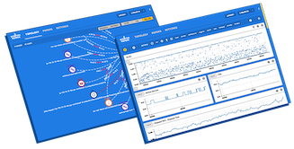

## [SCOUTER PAPER](https://github.com/scouter-contrib/scouter-paper) 커미터 프로그램을 시작합니다.

컨트리뷰톤을 시작으로 스카우터 페이퍼 커미터 프로그램이 진행됩니다. 
컨트리뷰톤에 참여하여 오픈소스에 기여하는 경험도 하고 스카우터에서 제공하는 기념품도 받아가세요. 

## 스카우터 페이퍼가 뭔가요?, 컨트리뷰톤이 뭔가요?

### [스카우터 페이퍼](https://scouter-contrib.github.io/scouter-paper/)는 오픈소스 모니터링 대시보드입니다.
 - 토폴로지와 대시보드 및 어플리케이션 트레이싱을 제공합니다.
 - 오픈소스 APM인 [스카우터](https://github.com/scouter-project/scouter)와 성능 메트릭 수집기인 [텔레그라프](https://www.influxdata.com/time-series-platform/telegraf/) 및 [Zipkin](https://zipkin.io/)에서 수집된 정보를 사용자가 원하는 형태로 구성하여 모니터링 하게 됩니다.
 - 보다 자세한 정보는 [영상](https://youtu.be/NjJ0dGhdIbU)과 [사이트](https://scouter-contrib.github.io/scouter-paper/)를 통해 확인하세요.
 - 2018 공개소프트웨어대회에서 대상을 수상하였습니다.([https://goo.gl/jRKhaa](https://goo.gl/jRKhaa))

### 컨트리뷰톤이란?
주어진 기간동안 정해진 방식으로 특정 오픈 소스에 소스 등을 기여하는 행사를 말합니다.  
이번 스카우터 페이퍼의 컨트리뷰톤은 미리 주어진 이슈들 중 하나 이상을 선택한 후 이에 대한 기능을 개발하게 됩니다.
 - 각 이슈에는 상세한 요건과 구현 방법이 설명되어 있습니다.
 - 각 이슈마다 포인트가 명시(contributhon-1.0x는 1)되어 있으며 해당 이슈 구현시 포인트가 부여됩니다.
 - **구현하고 싶은 이슈를 제안**해 주실수도 있습니다.(적절한 제안이면 포인트를 부여하여 컨트리뷰톤 이슈로 등록해 드립니다.)

## 컨트리뷰톤 일정
3월 8일부터 4월 20일까지 6주간
 - Pull Request 일정입니다.(PR 후 리뷰 및 머지는 그 이후 일정으로 진행되어도 무방합니다.)

## 참가자 혜택
 - [Gitter](https://gitter.im/paper-contributhon/community?utm_source=share-link&utm_medium=link&utm_campaign=share-link)를 통한 온라인 멘토링 (컨트리뷰션을 떠 먹여 드립니다.)
   - 오픈소스에 컨트리뷰션 하는 과정을 배워보세요.
 - 1 포인트 달성시 [스카우터 굿즈](./scouter-goods.md)(후드티) 증정 (2 point 달성시 추가 굿즈~)
 - 행사 이후에는 오프라인 모임이 있습니다. 원하시는 분들은 참석 하실 수 있습니다.
 - 1 포인트 이상 컨트리뷰션한 분들은 커미터 프로그램에 참여할 수 있습니다.
 - 커미터가 되시면 스카우터 페이퍼의 의사 결정에 참여할 수 있으며, 커밋 권한을 가지게 됩니다. 또한 [공식 페이지의 프로필](https://scouter-contrib.github.io/scouter-paper/index.html#people-who-make)에 게재됩니다.
 - 스카우터에도 관심있으시다면 스카우터의 개발에도 참여하실 수 있습니다.

## 참가 방법
 - 먼저 Gitter와 Email을 통해 참가 신청을 합니다.
   - 그냥 아래 Gitter 배지를 클릭하여, Gitter의 contributon 방에 참여한 후 인사를 하고 참여 의사를 밝혀 주시면 됩니다. :)
   - 이거 => 
     - 참여 의사를 밝히시면 컨트리뷰톤 [Score Board](./score-board.md)에 github 계정 정보가 게시됩니다. 원치 않으시면 미리 말씀해주세요.
   - 행사 진행사항 공지 발송등을 위해서 email이 필요합니다. 아래 email로 github ID와 연락가능한 **email**을 보내주세요.
     - gunlee01@gmail.com
   
 - Github의 scouter-paper 레포지토리를 개인 저장소로 포크한 후에 로컬로 클론하여 체크아웃 합니다.
   - Github을 통한 컨트리뷰션이 처음이라면 이 [글(GihHub-프로젝트에-기여하기)](https://git-scm.com/book/ko/v2/GitHub-GitHub-%ED%94%84%EB%A1%9C%EC%A0%9D%ED%8A%B8%EC%97%90-%EA%B8%B0%EC%97%AC%ED%95%98%EA%B8%B0)을 참고하세요.

 - scouter-paper를 개발하기 위한 개발 환경을 구성합니다.
   - 그냥 npm install & npm run start 만 하면 됩니다.
   - 상세한 내용은 [개발환경 구성 및 데모 환경 연결](./preparing-development.md)을 참고하세요.

 - 준비가 끝나면 [Github에 등록된 이슈들](https://github.com/scouter-contrib/scouter-paper/issues)을 확인하고, 해결할 이슈를 선택하여 작업하시면 됩니다.
   - 각 이슈에는 요건과 개발 방법이 설명되어 있습니다.
   - `Contributhon` 태그가 달린 이슈가 대상입니다.
   - `Good for 1st contribution`이 가장 쉬운 이슈입니다.

 - 작업하면서 궁금한 점은 Gitter를 통하여 질문합니다. (친절히 설명드립니다.)
   - 화면 개발에 대해서는 mindplates에게 질문합니다.
   - Scouter나 Web API등에 대해서는 GunLee에게 질문합니다.

 - 개발이 완료되면 본인의 레포지토리로 커밋 후에 Scouter-Paper 저장소로 Pull Request를 요청합니다.
 - 코드 리뷰가 진행되고 필요시 수정을 요청합니다. 머지할 수준의 코드가 되었다면 리뷰어가 LGTM을 코멘트하고 중앙 저장소로 머지가 됩니다. 머지가 되면 포인트가 부여되고 [컨트리뷰톤 스코어보드](./score-board.md)에 정보(Github의 닉네임, 이메일, 점수, 랭킹)가 게재 됩니다.

## 스카우터 페이퍼 기술셋 & ?
스카우터 페이퍼는 React & D3로 개발된 순수 프론트엔드 어플리케이션입니다.  
스카우터에서 제공하는 Web API를 통해 조회된 성능 메트릭 데이터를 대시보드나 토폴로지 등을 사용하여 보여주게 됩니다.  
**나는 React를 잘 모르는데? 나는 프론트엔드 개발자가 아닌데?** 라고 겁먹지 마시고 일단 참여해 보세요.  
스카우터 페이퍼는 백엔드 출신의 개발자가 React를 공부하면서 만든 어플리케이션입니다.  
프론트엔드 개발자라면 더 좋은 구성을 제안해 주실수 있을 것이고, React가 처음이라면 혹은 GitHub을 통한 소스기여가 처음이라면 여기서 같이 공부하면서 기여해보세요.  
스카우터 페이퍼는 이제 막 시작된 오픈소스이며, 저와 또다른 한명의 커미터도 오픈소스를 막 시작하는 **초보 오픈소스er**입니다. 많은 분들이 조인하여 함께 좋은 오픈 소스를 만들고 싶습니다.  
진행하면서 어려운 부분이 있다면 Gitter를 통해 언제라도 부담없이 질문 해주세요.  
Gitter는 항상 열려 있습니다. 

## 컨트리뷰톤 참여하기 정리!
이렇게 해보세요.
 - [소개 동영상](https://youtu.be/NjJ0dGhdIbU)을 보고 스카우터 페이퍼가 어떤 어플리케이션인지 확인해보세요.
 - GitHub에 [등록된 이슈](https://github.com/scouter-contrib/scouter-paper/issues)들을 보고 개발할 이슈를 정해보세요.
 - [개발환경 구성 가이드](./preparing-development.md)를 보고 개발 환경을 구성해보세요.
 - [Gitter](https://gitter.im/paper-contributhon/community?utm_source=share-link&utm_medium=link&utm_campaign=share-link)에서 참여 의사를 밝혀주세요.
   - 
