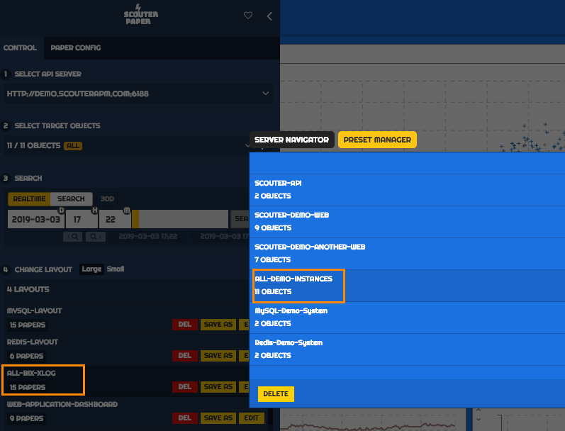
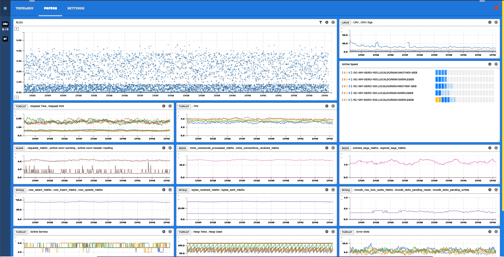

# 스카우터 페이퍼 컨트리뷰션 개발환경 구성

## Github에 가입하기.
[https://www.github.com](https://www.github.com)에 가입합니다~~
 
## Git 환경 구성
Git이 설치되어 있지 않다면 Git을 설치합니다.
 - 여기([시작하기-Git-설치](https://git-scm.com/book/ko/v2/%EC%8B%9C%EC%9E%91%ED%95%98%EA%B8%B0-Git-%EC%84%A4%EC%B9%98))를 참고해보세요.

## NPM 설치
npm은 스카우터 페이퍼에서 빌드와 패키지 의존성 관리를 위해 사용합니다.
NodeJS를 설치하면 같이 설치가 됩니다.
 - [https://nodejs.org/ko/download/](https://nodejs.org/ko/download/)
 
## 본격적인 개발환경 구성

### scouter-paper를 자신의 repository로 Fork 합니다.
 - 스카우터 페이퍼 GitHub 리포지토리([https://github.com/scouter-contrib/scouter-paper](https://github.com/scouter-contrib/scouter-paper))에 있는 Fork 버튼을 통해 자신의 리포지토리로 Fork 한 후에 이를 로컬 개발환경(PC)에 clone하여 소스를 받습니다.
   - 만약 Fork한 내 repository가 gunlee01/scouter-paper라면
	   - `git clone https://github.com/gunlee01/scouter-paper.git`
 
### 의존하는 라이브러리들을 설치합니다.
 - clone하면 `scouter-paper`라는 디록토리가 생성되고 그 디렉토리 안에 scouter-paper 소스가 위치하게 됩니다.
 - 해당 디렉토리로 간 후에 npm을 통해 의존하는 패키지들을 설치해줍니다.
```bash
cd scouter-paper
npm install
```

### 테스트를 위해 소스를 로컬에서 실행해봅니다.
```bash
npm run start
```
이렇게 실행하면 자동으로 기본 브라우저를 사용하여 `http://localhost:3000` 으로 접속합니다.
만약 브라우저가 자동으로 실행되지 않으면 위 url로 직접 접속해보세요.

### SCOUTER의 데모 서버와 연결하여 화면이 동작하는 것을 확인합니다. 
 - 처음에 접속하면 SCOUTER API Server에 접속할 수 없으므로 이에 대한 접속 설정을 먼저 합니다.
   - SETTINGS 메뉴로 들어간 후에 **EDIT** 버튼으로 수정 모드를 활성화 합니다.
   - `SCOUTER WEB API SERVER INFO` 영역에서 설정을 아래와 같이 변경합니다.
     - address: demo.scouterapm.com
     - port: 6188
     - auth type: N/A
 - 설정을 저장하고 새로고침 하여 PAPER 메뉴로 가면 좌측 서랍메뉴를 통해 조회 조건등의 설정을 할 수 있습니다.
 - 아래 그림은 PRESET과 LAYOUT 설정 메뉴입니다. 그림과 같이 설정하니 이런 형태의 화면이 보여지네요.


 - 메뉴를 눌러보며 대략적인 사용법을 익혀봅니다.

### 개발이 완료되면 본인의 repository에 커밋한 후에 이를 upstream에 반영 요청하기 위해 Pull Request를 작성합니다.
 - Pull Request 작성시 연관된 issue 번호를 명시합니다. 
 - Pull Request의 Target 브랜치는 develop 브랜치로 합니다.
 - 소스 코드에 대해서 개선 의견이 있으면 리뷰어가 코멘트를 달게 됩니다.
 - 코드 리뷰 과정을 마치게 되면 PR이 승인되고 소스는 upstream에 머지되게 됩니다.
 
### 머지된 후에 